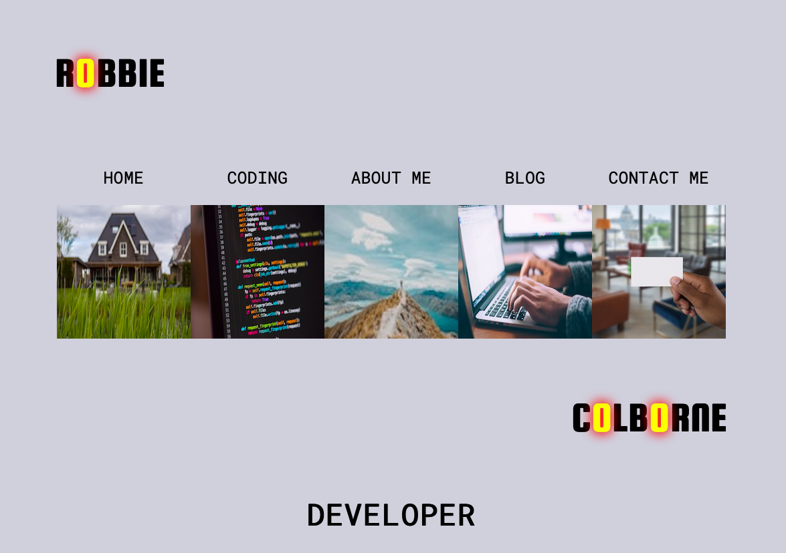
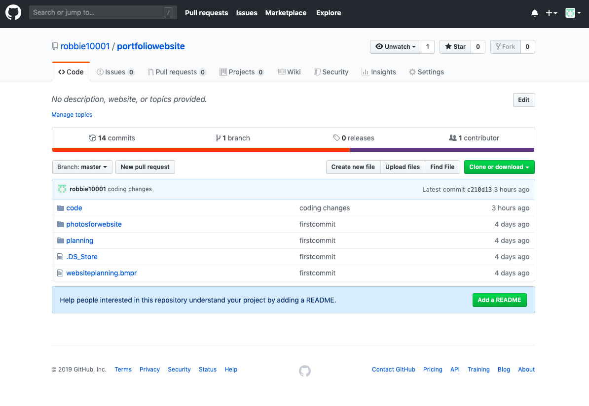
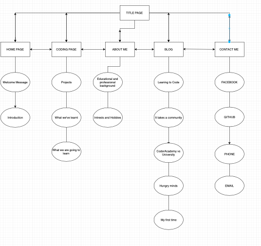

##Documentation

###Website

https://robbiecolborne.netlify.com

####GitHub Repository

https://github.com/robbie10001/portfoliowebsite

####Purpose Statement 

The purpose of my website is to provide information about myself to a prospective employer. This is achieved by providing information about myself and the projects I have completed as a developer. The website itself is indicative of my abilities using CSS and HTML. The other pages, illustrate by professional background, my interests and are in themselves a showcase of my work.

####Functionality and Features 

My website was designed for easy of use. I have included media breakpoints in order that the website remains appealing on any device. I have also included a navigation bar that facilitates easy of use. I have also attempted to make my website as accessible as possible for those with disabilities. This has been achieved through the use of audits on chrome dev tools and through the use of chrome extensions to assess the usability of my website for the visually impaired. 

My website, makes slight use of animations. This is true of the opening page. This feature acts to make my website unique, and make my name more memorable to an employer.  

My website features images that when pressed act as links to other areas of my website. This feature is able to break up what would other be useless text and provides a more profitable user experience. 

My website feature images that are in fact links to other websites, this feature enables users to have a more enjoyable experience when opposed to simple hyperlinks. 

The website also features the use of psuedo-classes throughout it. These are employed with the intention that they will enable the user to have a more enjoyable experience while using my website and illustrate to an employer my abilities at front-end web development. 

Lastly, my website has a feature on my contact page that allows the user to hover over my phone in order for my number to appear. I believe this is a cool experience for the user and makes my website and myself by extension memorable. 

####Site Map 

In terms of my site map, i could have added that all the websites link to each other through the navigation bar. However, i think this would detract from the clarity of the Site Map and therefore have excluded these connections. For example, you can get to the contact page from the home page and the about me page from the contant me page. 

###Target Audience 

The target audience for this website is for anyone interested in my career as a developer. This could be co-workers, people I make contact with through websites, people I meet at meetups and so on. More specifically, the focused target audience is for a potential employer. My website would allow such a organisation to see my work and learn more about me. Hopefully, this would make me an attractive candidate for a position. 

###Tech Stack 

The languages used in the creation of this website were HTML5 and CSS3. This front-end developer languages allowed the website to do everything I wanted. Potentially, the website could be improved in the future with the use of Java Script. 

In order to publish the website, the platform Netlify was utilised. 

In terms of accessibility, chrome developer tools audits were used. 

Chrome developer tools were also a major part of the testing of the features, HTML and CSS. 